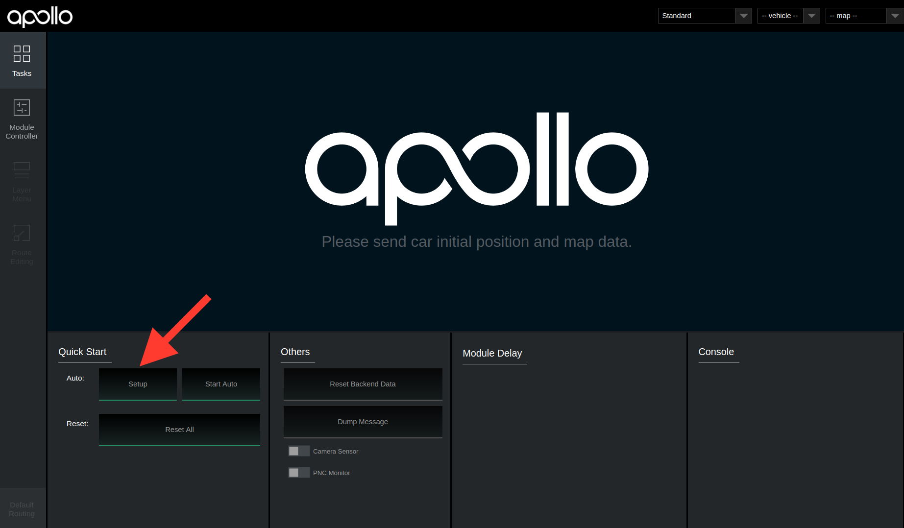

# Apollo 2.0 快速入门指南

这个快速入门指南专注于Apollo 2.0新功能的介绍。对于Apollo的一般概念，请参考 [Apollo 1.0 快速入门指南](../Quick Start/apollo_1_0_quick_start_cn.md)和[Apollo软件安装指南](https://github.com/ApolloAuto/apollo/blob/r3.0.0/docs/quickstart/apollo_software_installation_guide_cn.md)。

# 上车测试

1. 上车测试，请确认你已经调试了所有传感器之间的外部参数。关于传感器标定，请参考[Apollo 2.0 Sensor Calibration Guide](../Hardware Integration and Calibration/传感器标定/apollo_2_0_sensor_calibration_guide_cn.md).

2. 启动发布的环境的Docker镜像

3. 启动DreamView

    打开浏览器（譬如Chrome）然后在地址栏输入**localhost:8887**来开始Apollo的HMI。

    

4. 选择车辆和地图

     单击右上角下拉菜单选择车辆和地图。这个列表是在[HMI config file](ttps://raw.githubusercontent.com/ApolloAuto/apollo/master/modules/dreamview/conf/hmi.conf)中定义的。

5. 启动所有模块

    点击左侧的"Setup"按钮来设置。

    

    跳转到*Module Controller*页面，检查所有的软硬件都已正常工作。

     

6. 谨慎启动自动驾驶模式

    确定硬件已经齐备，所有模块已经打开并且汽车状态良好，环境安全，点击"Start Auto"按钮，然后它就会自动带你走！

    
