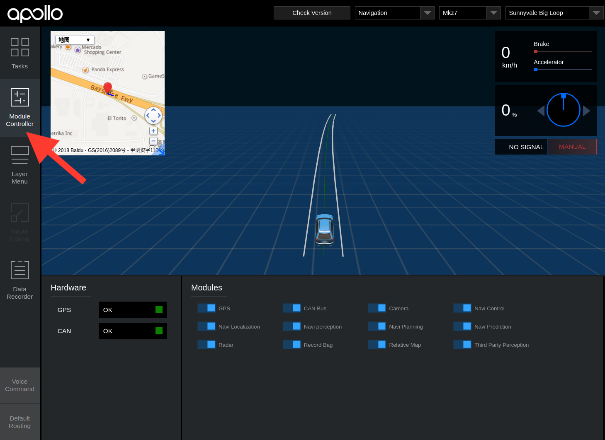

# Apollo 6.0 快速入门指南

以下指南是用于在车辆上启动Apollo软硬件套件的用户手册， 整体内容与Apollo 5.5类似。本快速入门指南重点介绍新功能，对于 Apollo 的一般概念，请参阅[Apollo 5.5 快速入门指南](./apollo_5_5_quick_start.md)

## 内容

- [Apollo 6.0 快速入门指南](#apollo-60-快速入门指南)
  - [内容](#内容)
  - [紧急车辆音频检测](#紧急车辆音频检测)
  - [硬件和软件安装](#硬件和软件安装)
  - [Dreamview的使用](#dreamview的使用)
  - [上车测试](#上车测试)

## 紧急车辆音频检测

Apollo目前通过音频设备集成了紧急车辆检测功能。在自动驾驶车辆上安装麦克风采集周围的音频信号，并对记录的音频进行分析和处理，以检测周围的紧急车辆。模块详细信息在[这里](../../modules/audio)。

Apollo集成了新的深度学习模型，包括使用PointPillars进行障碍物检测、使用语义地图进行行人预测以及基于学习的轨迹规划。请在对应的模块中寻找详细的信息。

## 硬件和软件安装

Apollo 6.0的硬件设置与Apollo 3.5相同，请参阅[Apollo 3.5 硬件与系统安装指南](../10Hardware%20Integration%20and%20Calibration/%E8%BD%A6%E8%BE%86%E9%9B%86%E6%88%90/%E7%A1%AC%E4%BB%B6%E5%AE%89%E8%A3%85hardware%20installation/apollo_3_5_hardware_system_installation_guide.md)获取安装硬件组件的步骤，参阅[Apollo软件安装指南](../01Installation%20Instructions/apollo_software_installation_guide_cn.md)获取软件安装步骤。

## Dreamview的使用

关于Dreamview图标的问题，请参考[Dreamview用法介绍](../12Apollo%20Tool/%E5%8F%AF%E8%A7%86%E5%8C%96%E4%BA%A4%E4%BA%92%E5%B7%A5%E5%85%B7Dremview/dreamview_usage_table_cn.md)。关于Dreamland和场景编辑器的问题，请参考[Dreamland简介](../12Apollo%20Tool/%E4%BA%91%E5%B9%B3%E5%8F%B0Apollo%20Studio/Dreamland_introduction.md)。

## 上车测试

1. 将一个外部磁盘驱动器接入主机任一可用USB接口。

2. 首先启动车辆，然后启动主机。

3. 启动Dev版本的Docker容器。

4. 启动Dreamview。

   打开浏览器（譬如Chrome）然后在地址栏输入 <http://localhost:8888>

   

5. 选择模式、车辆和地图。

   

   附注\: 在进行任何测试前会要求使用者设置参数。点击下拉列表并选择想要使用的导航模式，高清地图和车辆。该列表数据在[HMI配置文件目录](../../modules/dreamview/conf/hmi_modes)中定义。

   附注\: 允许使用者在HMI的右侧面板中更改参数，但是需要点击右上角的`Reset All`按钮重启该系统以使参数生效。

6. 启动模块。

   点击`Setup`按钮

   

   进入**Module Controller** 面板，检查是否所有的模块和硬件已经准备好（在离线环境中，某些硬件模块如GPS、CANBus、Velodyne、Camera和Radar不会显示）（为了获得良好的GPS信号，可能需要车辆运行一段距离。）

   

7. 在`Default Routing`中选择期望的路线。

8. 在`Tasks`面板中，点击`Start Auto`。（将要进入自动驾驶模式时需要十分小心谨慎）。

   

9. 自动驾驶测试结束后，在`Tasks`面板中点击`Reset All`，关闭所有窗口，关闭主机。

10. 移除磁盘驱动器。
