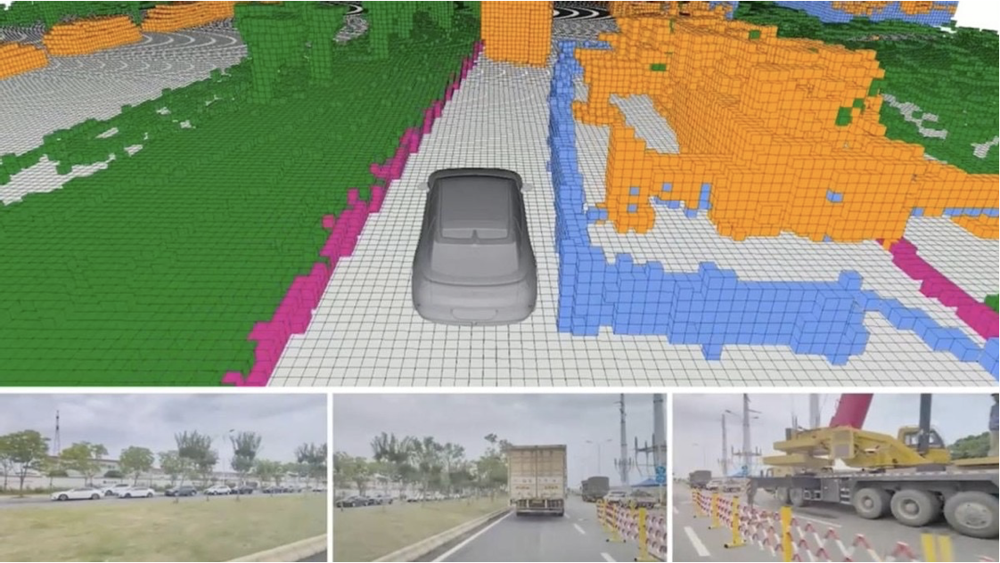
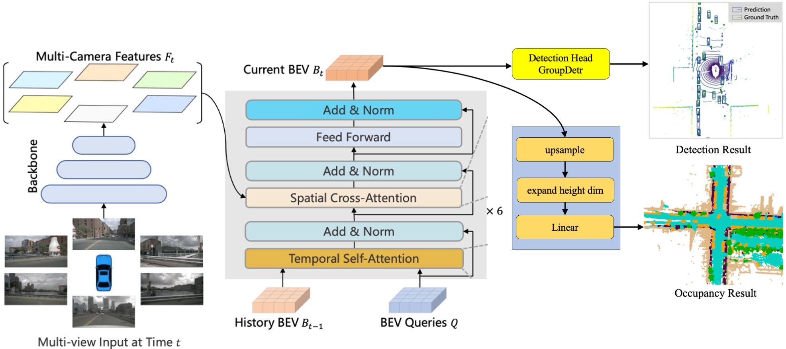
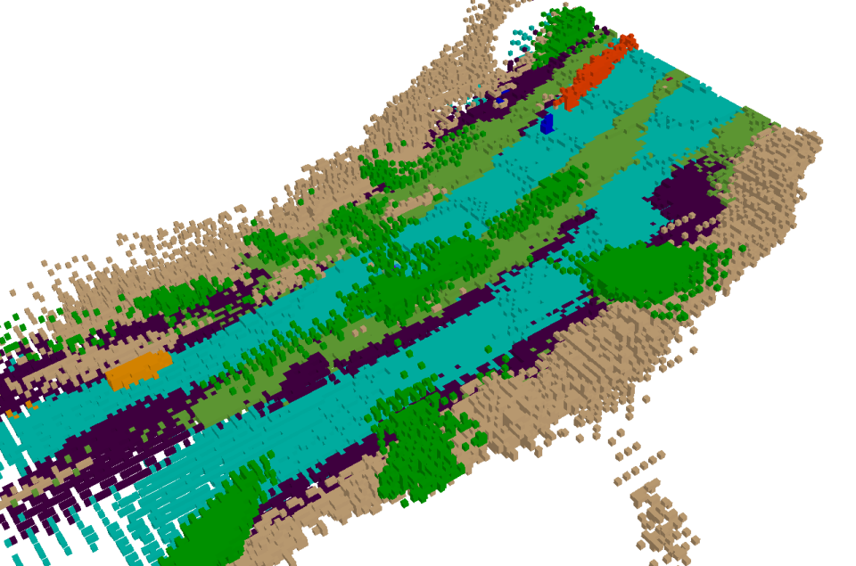

## 一、介绍

近些年来，基于纯视觉+BEV的目标检测和占据栅格任务称为自动驾驶的研究热点。2022年提出的BEVFormer网络，使用环视图像作为输入，使用Transformer架构生成BEV特征，完成目标检测任务。占据栅格任务是一种通过预测三维栅格来表达真实世界的任务，如下图所示，栅格代表对应位置被占据，不同颜色代表不同的类别。占据栅格任务可以很好地处理自动驾驶中面临的异形障碍物问题，为此受到广泛的研究。




Apollo 10.0发布了纯视觉模型Apollo-vision-Net，具有如下的特性：

1. 【 _更先进_ 】将视觉 bev 目标检测 + occ 占用网络的主流感知范式引入 Apollo 开源框架
2. 【 _效果好_ 】在业界经典模型基础之上进行优化，各自的效果均超越业界经典模型效果。目标检测 mAP 较 bevformer（2022 ECCV）提升 _6.74%_ ，occ miou较OccNet（2023 ICCV）提升 _2.39%_
3. 【 _性能高_ 】模型共享backbone，多任务联合训练优化，在单个 _jetson orin_ 平台上可达到 _5hz_ 的推理帧率，在效果与性能上均取得1+1>2的效果

## 二、Apollo-vision-Net 介绍

### 网络结构

Apollo-vision-Net的整体网络结构如下所示：

- 输入环视图像，经过image backbone提取图像特征
- Transformer encoder部分
  - 使用temporal self-attention融合当前帧bev queries和历史帧bev queries
  - 使用spatial cross-attention融合bev queries和图像特征
  - 经过6个encoder layer后输出bev queries
- detection head：将bev queries作为输入，使用groupdetr网络进行目标检测
- occ head：对bev queries进行上采样，随后扩充高度方向特征，最后使用linear层预测每个栅格类别信息



我们对Apollo-vision-Net进行了如下优化，显著提升了目标检测、占据栅格的分数以及模型性能：

- image backbone：使用深度估计数据（Toyota DDAD15M）预训练的DLA-34替换ResNet-50，降低了模型复杂度同时提升了效果
- image neck：使用SecondFPN网络替换单尺度FPN网络，提升了模型整体效果
- detection head：使用GroupDETR替换DETR，在不增加耗时的前提下，显著提升目标检测效果
- occ head：在Transformer encoder部分使用低分辨率bev queries（50\*50），在occ head部分再上采样至高分辨率（200\*200），可大幅提升模型性能
- occ loss：将occ focal loss weight从1.0提升至10.0，引入affinity loss和lovasz-softmax loss，大幅提升occ检测效果

### 定量结果

在Nuscenes数据集上，Apollo-vision-Net目标检测mAP分数超越bevformer-tiny（2022 ECCV） _6.74%_ ，超越OccNet-R50（2023 ICCV） _2.39%_

|                              | 目标检测mAP （val dataset） | 占据栅格miou (OpenOcc val dataset) |
| :--------------------------: | :-------------------------: | :--------------------------------: |
| bevformer-tiny （2022 ECCV） |            25.2%            |                 -                  |
|   OccNet-R50 （2023 ICCV）   |              -              |               19.48%               |
|   Apollo-vision-Net (ours)   |     31.94% （↑ 6.74%）      |         21.87% （↑ 2.39%）         |

### 定性结果

#### Nuscenes数据集结果

<table>
  <tr>
    <th colspan="3">图像</th>
    <th colspan="1">目标检测结果</th>
    <th colspan="1">occ结果</th>
  </tr>
  <tr>
    <td></td>
    <td></td>
    <td></td>
    <td rowspan=2></td>
    <td rowspan=2></td>
  </tr>
  <tr>
    <td></td>
    <td></td>
    <td></td>
  </tr>
</table>

#### 百度自动驾驶数据集结果

为了进一步验证效果，我们使用百度自动驾驶数据对Apollo-vision-Net进行训练，同时对occ的分辨率进行提升（0.5m*0.5m*0.5m->0.2m*0.2m*0.2m）可以看到Apollo-vision-Net可以提供复杂城市道路场景下的准确目标检测和occ检测。

[效果](https://apollo-docs.cdn.bcebos.com/apollo/perception-vision-obj-detection-occ-prediction-video-1.mp4)

## 三、Apollo中运行纯视觉模型

### 运行流程

#### 进入源码环境

先根据教程安装apollo环境，随后进入容器

```bash
bash docker/scripts/dev_start.sh
bash docker/scripts/dev_into.sh
```

默认在modules/perception/data/models/bev_occ/目录下有apollo官方的onnx文件

编译

```bash
bash apollo.sh build_opt_gpu
```

打开dreamview

```bash
bash scripts/bootstrap.sh start_plus
```

#### 进入包管理环境

进入容器

```bash
aem start
aem enter
```

安装包

```bash
buildtool build --gpu -p park-generic --opt
```

打开dreamview

```bash
aem bootstrap start --plus
```

#### 播放record

通过下面链接可以下载nuscenes record：

|                id                |                                                                                                                            link                                                                                                                             |
| :------------------------------: | :---------------------------------------------------------------------------------------------------------------------------------------------------------------------------------------------------------------------------------------------------------: |
| 6f83169d067343658251f72e1dd17dbc | https://apollo-perception.bj.bcebos.com/nuscenes_occ_records/6f83169d067343658251f72e1dd17dbc.record?authorization=bce-auth-v1/ALTAKg5yEiU4seODUEbcZVtvIv/2024-10-28T06%3A27%3A55Z/-1/host/5b98d91e1c403f78da08eb45498866abe7f4ba6458e4a4aaa00a2c42c4e80798 |
| 2fc3753772e241f2ab2cd16a784cc680 | https://apollo-perception.bj.bcebos.com/nuscenes_occ_records/2fc3753772e241f2ab2cd16a784cc680.record?authorization=bce-auth-v1/ALTAKg5yEiU4seODUEbcZVtvIv/2024-10-28T06%3A46%3A06Z/-1/host/c71f5b47abfe012a352d4ce4cd959f10579063ebcff5acecf965353f183bdb8f |
| bebf5f5b2a674631ab5c88fd1aa9e87a | https://apollo-perception.bj.bcebos.com/nuscenes_occ_records/bebf5f5b2a674631ab5c88fd1aa9e87a.record?authorization=bce-auth-v1/ALTAKg5yEiU4seODUEbcZVtvIv/2024-10-28T06%3A46%3A28Z/-1/host/85f5300f9a26a7642ca6e1dc19a91634b90e9e271798a1e7d19dbae92c333543 |

选择车型——Nuscenes Occ


启动transform dag文件

```bash
mainboard -d /apollo/modules/transform/dag/static_transform.dag
```

启动dag文件

```bash
mainboard -d /apollo/modules/perception/camera_detection_occupancy/dag/camera_detection_occupancy_nus.dag
```

等待模型进行序列化，当终端给出如下日志时表示序列化完成，可进行下面的步骤

```bash
bevformer model init success from apollo_bevnet.onnx
```

播放record包

```bash
cyber_recorder play -f fcbccedd61424f1b85dcbf8f897f9754.record
```

随后就可以在dv上看到目标检测结果


#### 可视化occ结果

如果要查看occ结果，需要进行如下的步骤：

将配置occ_det_nus.pb.txt中save_occ_result设置为true，同时设置保存路径occ_save_path（默认为data/occ_results）

运行launch文件，随后会在occ_save_path路径下自动保存occ结果

在容器外配置可视化环境

```bash
conda create -n occ_vis python=3.7 -y
conda activate occ
pip install numpy
pip install mayavi
```

将modules/perception/camera_detection_occupancy/tools/occ_vis.py中的occ_path设置为occ_save_path

运行可视化脚本

```bash
python modules/perception/camera_detection_occupancy/tools/occ_vis.py
```

就可以显示occ结果



#### 参数介绍

<table>
  <thead>
    <tr>
      <th>参数</th>
      <th>含义</th>
      <th>默认值</th>
    </tr>
  </thead>
  <tbody>
    <tr>
      <td>name</td>
      <td>模型名称</td>
      <td>apollo_bevnet_onnx</td>
    </tr>
    <tr>
      <td>version</td>
      <td>版本</td>
      <td>-</td>
    </tr>
    <tr>
      <td>dataset</td>
      <td>数据集</td>
      <td>nuScenes</td>
    </tr>
    <tr>
      <td>task_type</td>
      <td>任务类型</td>
      <td>Detection3D</td>
    </tr>
    <tr>
      <td>sensor_type</td>
      <td>传感器类型</td>
      <td>Camera</td>
    </tr>
    <tr>
      <td>framework</td>
      <td>框架</td>
      <td>Onnx</td>
    </tr>
    <tr>
      <td>proto_file weight_file</td>
      <td>onnx文件名称</td>
      <td>apollo_bevnet.onnx</td>
    </tr>
    <tr>
      <td>inputs</td>
      <td>模型输入的名称及形状</td>
      <td>
        <pre>
          <code>
            inputs {
              name: "image"
              shape: 1
              shape: 6
              shape: 3
              shape: 480
              shape: 800
            }
            inputs {
              name: "prev_bev"
              shape: 2500
              shape: 1
              shape: 256
            }
            inputs {
              name: "use_prev_bev"
              shape: 1
            }
            inputs {
              name: "can_bus"
              shape: 18
            }
            inputs {
              name: "lidar2img"
              shape: 1
              shape: 6
              shape: 4
              shape: 4
            }
            inputs {
              name: "no_pad_image_shape"
              shape: 2
            }
          </code>
        </pre>
      </td>
    </tr>
    <tr>
      <td>outputs</td>
      <td>模型输出的名称及形状</td>
      <td>
        <pre>
          <code>
            outputs {
              name: "bev_embed"
              shape: 2500
              shape: 1
              shape: 256
            }
            outputs {
              name: "outputs_classes"
              shape: 6
              shape: 1
              shape: 900
              shape: 10
            }
            outputs {
              name: "outputs_coords"
              shape: 6
              shape: 1
              shape: 900
              shape: 8
            }
            outputs {
              name: "outputs_occupancy"
              shape: 1
              shape: 640000
              shape: 16
            }
          </code>
        </pre>
      </td>
    </tr>
    <tr>
      <td>class_names</td>
      <td>目标检测的类别</td>
      <td>
        <pre>
          <code>
            class_names: "car"
            class_names: "truck"
            class_names: "construction_vehicle"
            class_names: "bus"
            class_names: "trailer"
            class_names: "barrier"
            class_names: "motorcycle"
            class_names: "bicycle"
            class_names: "pedestrian"
            class_names: "traffic_cone"
          </code>
        </pre>
    </tr>
    <tr>
      <td>resize</td>
      <td>输入图像尺寸</td>
      <td>
        <pre>
          <code>
            {
              width: 800
              height: 480
            }
          </code>
        </pre>
      </td>
    </tr>
    <tr>
      <td>normalize</td>
      <td>图像归一化参数</td>
      <td>
        <pre>
          <code>
            {
              mean: 103.530
              mean: 116.280
              mean: 123.675
              std: 57.375
              std: 57.120
              std: 58.395
            }
          </code>
        </pre>
      </td>
    </tr>
    <tr>
      <td>score_threshold</td>
      <td>目标检测置信度阈值</td>
      <td>0.3</td>
    </tr>
    <tr>
      <td>img_scale</td>
      <td>图像缩放比例</td>
      <td>0.5</td>
    </tr>
    <tr>
      <td>no_pad_image_width no_pad_image_height</td>
      <td>pad之前图像大小</td>
      <td>450 800</td>
    </tr>
    <tr>
      <td>
        occ_xmin</br>
        occ_xmax</br>
        occ_ymin</br>
        occ_ymax</br>
        occ_zmin</br>
        occ_zmax
      </td>
      <td>occ的检测范围</td>
      <td>
        <pre>
          <code>
            occ_xmin: -50
            occ_xmax: 50
            occ_ymin: -50
            occ_ymax: 50
            occ_zmin: -5.0
            occ_zmax: 3.0
          </code>
        </pre>
      </td>
    </tr>
    <tr>
      <td>voxel_size</td>
      <td>occ的栅格尺寸</td>
      <td>0.5</td>
    </tr>
    <tr>
      <td>location_dist_threshold</td>
      <td>前后两帧定位距离之差的阈值</td>
      <td>10.0</td>
    </tr>
    <tr>
      <td>save_occ_result</td>
      <td>是否保存occ结果</td>
      <td>false</td>
    </tr>
    <tr>
      <td>occ_save_path</td>
      <td>occ结果保存路径</td>
      <td>"data/occ_results"</td>
    </tr>
    <tr>
      <td>occ_threshold</td>
      <td>occ阈值，小于阈值为空voxel</td>
      <td>0.25</td>
    </tr>
  </tbody>
</table>

## 四、模型训练教程

本部分介绍如何使用nuscenes数据集训练apollo纯视觉模型

### 环境配置

创建conda虚拟环境

```bash
conda create -n occ python=3.7 -y
conda activate occ
```

按照 [官方教程](https://pytorch.org/) 安装pytorch

```bash
conda install pytorch==1.10.0 torchvision==0.11.0 torchaudio==0.10.0 cudatoolkit=10.2 -c pytorch
```

安装mmcv-full

```bash
pip install mmcv-full==1.4.1
```

安装mmdet和mmsegmentation

```bash
pip install mmdet==2.19.0
pip install mmsegmentation==0.20.0
```

安装mmdetection3d

```bash
git clone https://github.com/open-mmlab/mmdetection3d.git
cd mmdetection3d
git checkout v0.18.1 # Other versions may not be compatible.
python setup.py develop
```

安装timm

```bash
pip install timm
```

下载代码

```bash
git clone xxx
```

### 数据下载

在 [Nuscenes官方网站](https://www.nuscenes.org/download) 下载Nuscenes V1.0数据集，文件组织形式如下所示

```text
├── data/
│   ├── can_bus/
│   ├── nuscenes/
│   │   ├── maps/
│   │   ├── samples/
│   │   ├── sweeps/
│   │   ├── v1.0-test
│   │   ├── v1.0-trainval
```

生成3d目标检测的pkl文件data/nuscenes/nuscenes*infos_temporal*{train,val}.pkl

```bash
python tools/create_data.py nuscenes --root-path ./data/nuscenes --out-dir ./data/nuscenes --extra-tag nuscenes --version v1.0 --canbus ./data
```

准备3d Occupancy数据，数据集详细信息参考 [Scene as Occupancy](https://arxiv.org/abs/2306.02851)

下载数据并放入到data文件夹中

|       Version       | voxel size |                                          Google Drive                                           |                              Baidu Cloud                              | Size |
| :-----------------: | :--------: | :---------------------------------------------------------------------------------------------: | :-------------------------------------------------------------------: | :--: |
| occ_gt_release_v1_0 |    0.5m    | [train_val](https://drive.google.com/file/d/1Ds7NY475sS13A9KErr-MHlOBEY1oFi76/view?usp=sharing) | [train_val](https://pan.baidu.com/s/1O4iCdY7DOWts9KAIuRNT2A?pwd=hgk2) | ~15G |

解压文件

```bash
tar -zxvf occ_gt_release_v1_0.tar.gz
```

文件格式如下

```text
├── data/
│   ├── occ_gt_release_v1_0/
│   │   ├── train/
│   │   ├── val/
│   │   ├── occ_gt_train.json
│   │   ├── occ_gt_val.json
```

合并目标检测和occupancy的pkl文件，生成data/occ_gt_release_v1_0/nuscenes_infos_temporal\_{train,val}\_occ_gt.pkl，下方同时提供了新pkl的下载链接

```bash
python tools/create_data_with_occ.py
```

|       Version       |                                                                                      Google Drive                                                                                      |                                                            Baidu Cloud                                                             |
| :-----------------: | :------------------------------------------------------------------------------------------------------------------------------------------------------------------------------------: | :--------------------------------------------------------------------------------------------------------------------------------: |
| occ_gt_release_v1_0 | [train](https://drive.google.com/file/d/1iaJk40ieqoYDd_VjZALDbnRJHGpQ3Ybx/view?usp=sharing)\|[val](https://drive.google.com/file/d/1lE9h8t5dFVdZ9dBg01jTg7GeiAWIeytZ/view?usp=sharing) | [train](https://pan.baidu.com/s/1vzFGs6g9g7f_08QrItfVGw?pwd=djsh)\|[val](https://pan.baidu.com/s/1flOglbPh5BDb0i8QfpcIbQ?pwd=ntys) |

最终文件组织形式如下所示

```text
├── data/
│   ├── can_bus/
│   ├── nuscenes/
│   │   ├── maps/
│   │   ├── samples/
│   │   ├── sweeps/
│   │   ├── v1.0-test
│   │   ├── v1.0-trainval
│   │   ├── nuscenes_infos_temporal_train.pkl
│   │   ├── nuscenes_infos_temporal_val.pkl
│   ├── occ_gt_release_v1_0/
│   │   ├── train/
│   │   ├── val/
│   │   ├── occ_gt_train.json
│   │   ├── occ_gt_val.json
│   │   ├── nuscenes_infos_temporal_train_occ_gt.pkl
│   │   ├── nuscenes_infos_temporal_val_occ_gt.pkl
```

### 模型训练

训练模型的命令

```bash
./tools/dist_train.sh ./projects/configs/bevformer/bev_tiny_det_occ_apollo.py 8
```

### 模型评测

```bash
./tools/dist_test.sh ./projects/configs/bevformer/bev_tiny_det_occ_apollo.py ./path/to/ckpts.pth 4
```

### 可视化

根据 [教程](https://docs.enthought.com/mayavi/mayavi/installation.html) 安装mayavi

可视化occ结果

```bash
python tools/occ_visualization/visualize_occ_gt.py
```

## 五、模型部署教程

本部分介绍如何将训练好的模型导出为onnx格式，并部署到apollo工程中

### 环境配置

创建conda虚拟环境

```bash
conda create -n apollo-onnx python=3.7 -y
conda activate apollo-onnx
```

下载代码

```bash
git clone xxxxx
cd BEVFormer_tensorrt
PROJECT_DIR=$(pwd)
```

准备nuScenes数据集

```bash
cd ${PROJECT_DIR}/data
ln -s /path/to/nuscenes nuscenes
ln -s /path/to/can_bus can_bus
```

文件组织如下所示

```text
${PROJECT_DIR}/data/.
├── can_bus
│   ├── scene-0001_meta.json
│   ├── scene-0001_ms_imu.json
│   ├── scene-0001_pose.json
│   └── ...
└── nuscenes
    ├── maps
    ├── samples
    ├── sweeps
    └── v1.0-trainval
```

安装 `CUDA-11.6/cuDNN-8.6.0/TensorRT-8.5.1.7`

安装PyTorch和TorchVision

```bash
pip install torch==1.12.1+cu116 torchvision==0.13.1+cu116 torchaudio==0.12.1+cu116 --extra-index-url https://download.pytorch.org/whl/cu116
```

安装MMCV-full

```bash
git clone https://github.com/open-mmlab/mmcv.git
cd mmcv
git checkout v1.5.0
pip install -r requirements/optional.txt
MMCV_WITH_OPS=1 pip install -e .
```

安装MMDetection

```bash
git clone https://github.com/open-mmlab/mmdetection.git
cd mmdetection
git checkout v2.25.1
pip install -v -e .# "-v" means verbose, or more output# "-e" means installing a project in editable mode,# thus any local modifications made to the code will take effect without reinstallation.
```

安装MMDeploy

```bash
git clone git@github.com:open-mmlab/mmdeploy.git
cd mmdeploy
git checkout v0.10.0

git clone git@github.com:NVIDIA/cub.git third_party/cub
cd third_party/cub
git checkout c3cceac115

# go back to third_party directory and git clone pybind11cd ..
git clone git@github.com:pybind/pybind11.git pybind11
cd pybind11
git checkout 70a58c5
```

编译Tensorrt（确保cmake version >= 3.14.0 gcc version >= 7）

```bash
export MMDEPLOY_DIR=/the/root/path/of/MMDeploy
export TENSORRT_DIR=/the/path/of/tensorrt
export CUDNN_DIR=/the/path/of/cuda

export LD_LIBRARY_PATH=$TENSORRT_DIR/lib:$LD_LIBRARY_PATHexport LD_LIBRARY_PATH=$CUDNN_DIR/lib64:$LD_LIBRARY_PATHcd${MMDEPLOY_DIR}
mkdir -p build
cd build
cmake -DCMAKE_CXX_COMPILER=g++-7 -DMMDEPLOY_TARGET_BACKENDS=trt -DTENSORRT_DIR=${TENSORRT_DIR} -DCUDNN_DIR=${CUDNN_DIR} ..
make -j$(nproc)
make install
```

安装MMDeploy

```bash
cd ${MMDEPLOY_DIR}
pip install -v -e .# "-v" means verbose, or more output# "-e" means installing a project in editable mode,# thus any local modifications made to the code will take effect without reinstallation.
```

安装依赖

```bash
cd ${PROJECT_DIR}
pip install -r requirements.txt
```

【可选】安装Custom TensorRT Plugins（CUDA>=11.4, SM version>=7.5）

```bash
cd ${PROJECT_DIR}/TensorRT/build
cmake .. -DCMAKE_TENSORRT_PATH=/path/to/TensorRT
make -j$(nproc)
make install
```

安装MMDetection3D算子

```bash
cd ${PROJECT_DIR}/third_party/bev_mmdet3d
python setup.py build develop
```

### 生成onnx文件

运行下面的命令，提供pth文件，生成onnx文件

```bash
python tools/pth2onnx.py configs/apollo_bev/bev_tiny_det_occ_apollo_trt.py path_pth --opset_version 13 --cuda
```

### apollo部署

根据教程安装apollo环境，随后进入容器

```bash
bash docker/scripts/dev_into.sh
```

如果要替换为自己训练的onnx文件，则需要替换掉目录下的onnx文件

```bash
sudo rm -rf modules/perception/data/models/apollo_bevnet_onnx/*
sudo cp your-own-onnx modules/perception/data/models/apollo_bevnet_onnx/
```

随后根据第三部分的教程运行纯视觉模型即可
